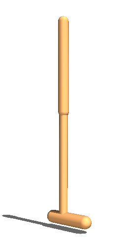

## CS275 Final Report: Explore Generalizable Policy ##
#### [[Project Page]](https://sites.google.com/g.ucla.edu/cs275-modular/home?authuser=1) [[Overleaf]](https://www.overleaf.com/project/60cb0c9cc6c2bc12562c3481)

Jiayue Sun, Yingge He, Qinglu Zhang

## Setup
### Requirements
- Python-3.6
- PyTorch-1.1.0
- CUDA-9.0
- CUDNN-7.6
- [MuJoCo-200](https://www.roboti.us/index.html): download binaries, put license file inside, and add path to .bashrc

### Setting up repository
  ```Shell
  git clone https://github.com/huangwl18/modular-rl.git
  cd modular-rl/
  python3.6 -m venv mrEnv
  source $PWD/mrEnv/bin/activate
  ```

### Installing Dependencies
  ```Shell
  pip install --upgrade pip
  pip install -r requirements.txt
  ```

## Running Code
| Flags and Parameters  | Description |
| ------------- | ------------- |
| ``--morphologies <List of STRING>``  | Find existing environments matching each keyword for training (e.g. walker, hopper, humanoid, and cheetah; see examples below)  |
| ``--custom_xml <PATH>``  | Path to custom `xml` file for training the modular policy.<br> When ``<PATH>`` is a file, train with that `xml` morphology only. <br> When ``<PATH>`` is a directory, train on all `xml` morphologies found in the directory.
| ``--expID <INT>``  | Experiment ID for creating saving directory  |
| ``--seed <INT>``  | (Optional) Seed for Gym, PyTorch and Numpy  |
  
### Train with existing environment
- Train both-way SMP on ``Walker++`` (12 variants of walker):
```Shell
python main.py --expID 001 --morphologies walker
  ```
- Train both-way SMP on ``Hopper++`` (3 variants of hopper):
```Shell
python main.py --expID 004 --morphologies hopper
  ```
  - To train both-way SMP for only one environment (e.g. ``walker_7_main``), specify the full name of  the environment without the ``.xml`` suffix:
```Shell
python main.py --expID 005 --morphologies walker_7_main
```

### Train with predefined agent group environment
- Agent group 2:
```Shell
./
```

### Visualization
- To visualize all ``walker`` environments with the both-way SMP model from experiment ``expID 001``:
```Shell
python visualize.py --expID 001 --morphologies walker
```
- To visualize only ``walker_7_main`` environment with the both-way SMP model from experiment ``expID 001``:
```Shell
python visualize.py --expID 001 --morphologies walker_7_main
```

## Provided Environments

<table>
    <tbody>
        <tr>
            <td align="center" style="text-align:center" colspan=6><b>Walker</b></td>
        </tr>
        <tr>
            <td align="center" style="text-align:center"><br>walker_2_main</td>
            <td align="center" style="text-align:center"><br>walker_3_main</td>
            <td align="center" style="text-align:center"><br>walker_4_main</td>
            <td align="center" style="text-align:center"><br>walker_5_main</td>
            <td align="center" style="text-align:center"><br>walker_6_main</td>
            <td align="center" style="text-align:center"><br>walker_7_main</td>
        </tr>
        <tr>
            <td align="center" style="text-align:center"><br>walker_2_flipped</td>
            <td align="center" style="text-align:center"><br>walker_3_flipped</td>
            <td align="center" style="text-align:center"><br>walker_4_flipped</td>
            <td align="center" style="text-align:center"><br>walker_5_flipped</td>
            <td align="center" style="text-align:center"><br>walker_6_flipped</td>
            <td align="center" style="text-align:center"><br>walker_7_flipped</td>
        </tr>
    </tbody>
</table>

<table>
    <tbody>
        <tr>
            <td align="center" style="text-align:center" colspan=3><b>Hopper</b></td>
        </tr>
        <tr>
            <td align="center" style="text-align:center"><br>hopper_3</td>
            <td align="center" style="text-align:center"><br>hopper_4</td>
            <td align="center" style="text-align:center"><br>hopper_5</td>
        </tr>
    </tbody>
</table>

Note that each walker agent has an identical instance of itself called ``flipped``, for which SMP always flips the torso message passed to both legs (e.g. the message that is passed to the left leg in the ``main`` instance is now passed the right leg).

## Acknowledgement
The TD3 code is based on this [open-source implementation](https://github.com/sfujim/TD3). The code for Dynamic Graph Neural Networks is adapted from [Modular Assemblies (Pathak*, Lu* et al., NeurIPS 2019)](https://pathak22.github.io/modular-assemblies/).

